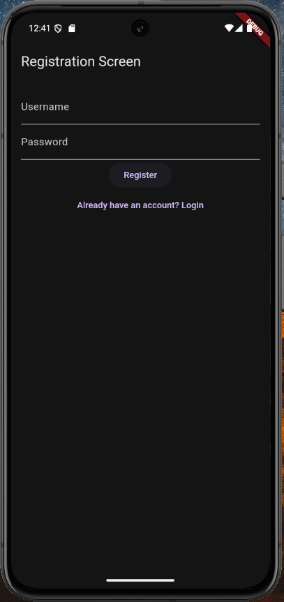
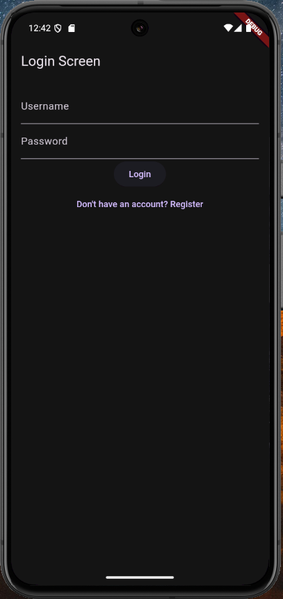
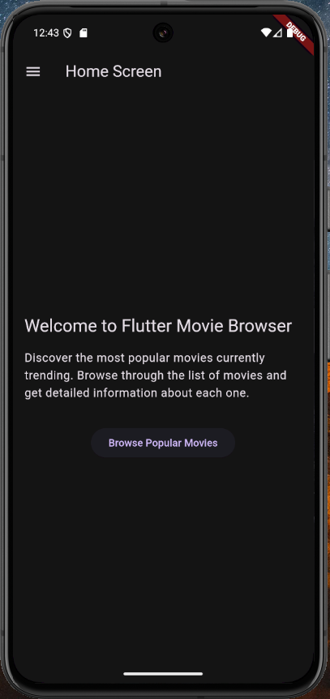
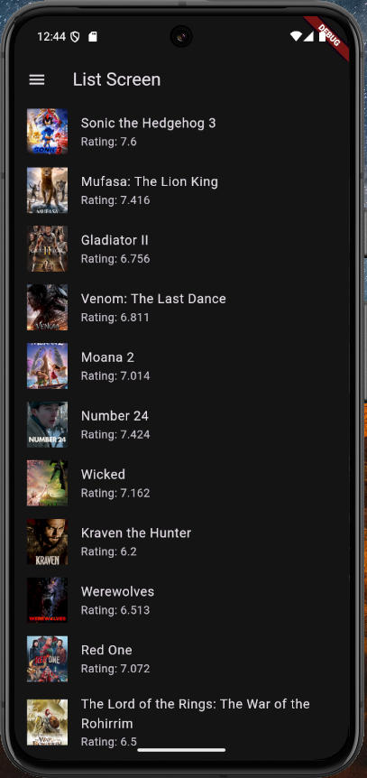
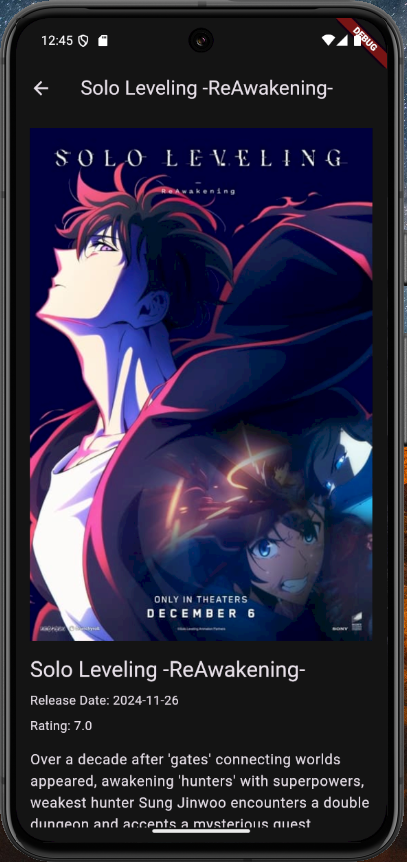
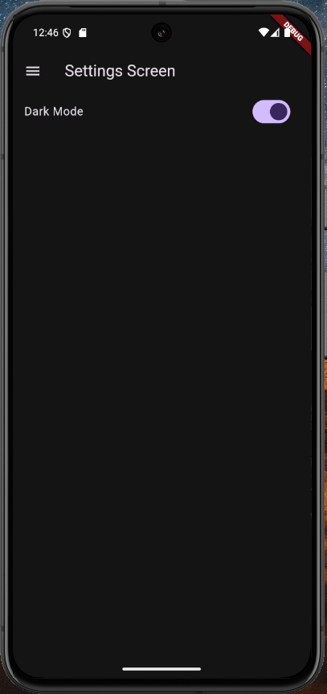

# Flutter Movie Browser

## Description
Flutter Movie Browser is a mobile application that allows users to browse popular movies, view movie details, and manage their theme preferences. Users can also register and log in to the application.

## Features
- Browse popular movies
- View detailed information about each movie
- Toggle between light and dark themes
- User registration and login

## Screenshots

### Registration Screen


### Login Screen


### Home Screen


### List Screen


### Details Screen


### Settings Screen



## Instructions for Running the Application

1. **Clone the repository:**
   ```sh
   git clone https://github.com/yourusername/flutter_movie_browser.git
   cd flutter_movie_browser
   ```

2. **Install dependencies:**
   ```sh
   flutter pub get
   ```

3. **Set up environment variables:**
   - Create a `.env` file in the root directory of the project.
   - Add your TMDB API key to the `.env` file:
     ```
     TMDB_API_KEY=your_api_key_here
     ```

4. **Run the application:**
   ```sh
   flutter run
   ```

## Dependencies
- Flutter
- http
- flutter_dotenv
- sqflite
- path
- provider
- shared_preferences

## License
This project is licensed under the MIT License.